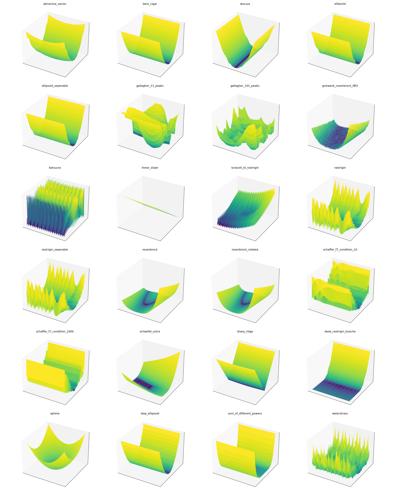
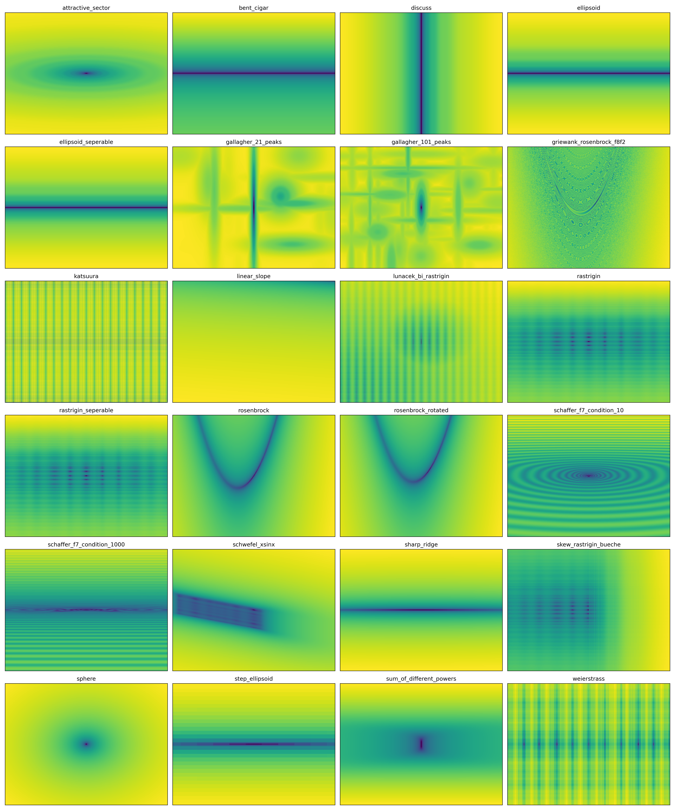
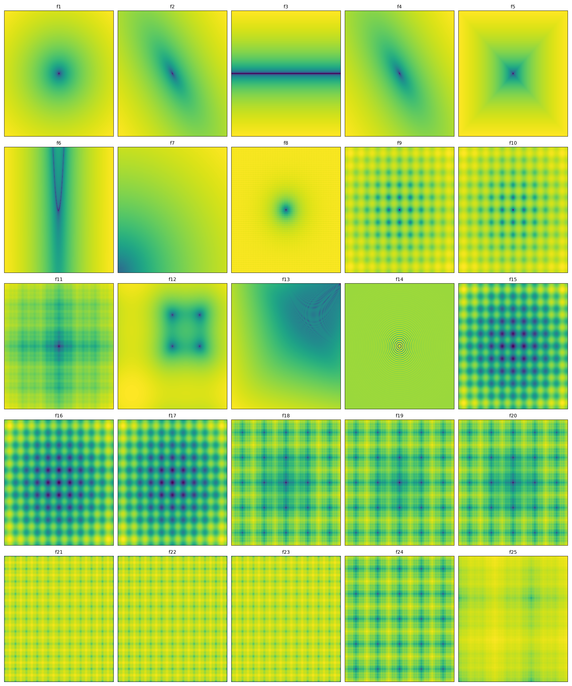
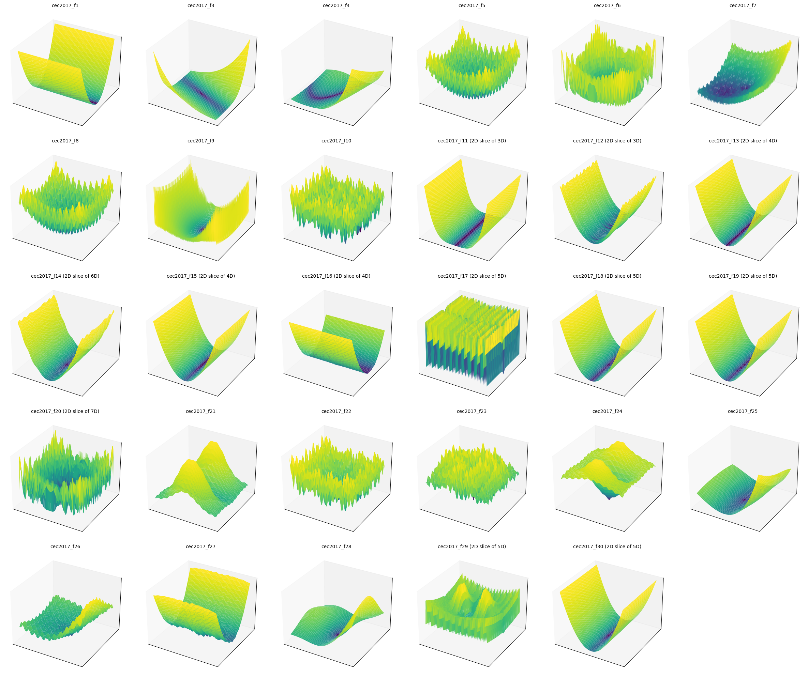
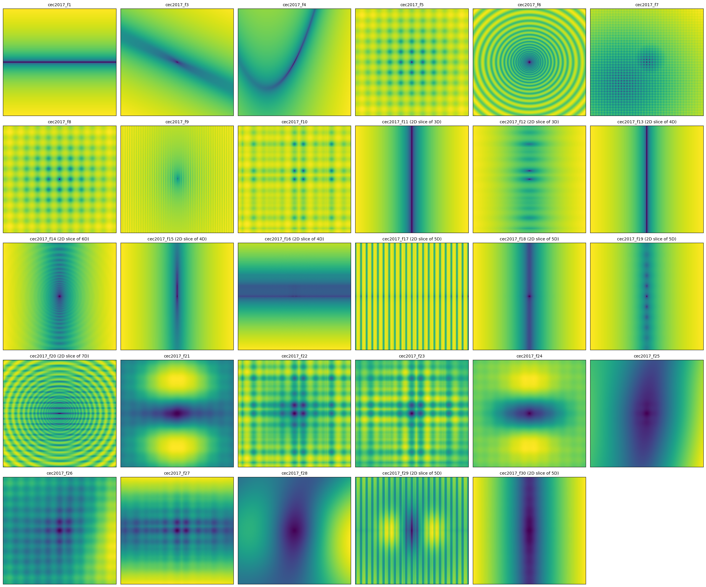

# Benchmark Functions for JAX

| [**GitHub**](https://github.com/bessagroup/bbob-jax)
| [**PyPI**](https://pypi.org/project/bbob-jax/)
| [**Documentation**](https://bbob-jax.readthedocs.io/)
| [**Zenodo**](https://doi.org/10.5281/zenodo.17426893) 

JAX implementations of the **BBOB** noise-free and **BBOB-noisy** benchmark functions (Finck et al., 2009) [^1][^6], the **CEC 2005** benchmark functions (Suganthan et al., 2005) [^4] and the **CEC 2017** benchmark functions (Awad et al., 2016) [^5] for black-box optimization.

**First publication:** October 17, 2025

***

## Summary

`bbob-jax` is a pure-[JAX](https://github.com/jax-ml/jax) reimplementation of four standard black-box optimization benchmark suites: the 24 noise-free **BBOB** functions (Finck et al., 2009), the 30 **BBOB-noisy** functions f101–f130 (Finck et al., 2009), the 25 **CEC 2005** real-parameter functions (Suganthan et al., 2005) and the 29 **CEC 2017** bound-constrained functions (Awad et al., 2016; F2 was officially withdrawn). Every function is differentiable, JIT-compilable, and vectorizable via `vmap`, and is exposed through a simple registry that returns a ready-to-call objective together with its global minimum, as well as a `problem()` accessor that additionally bundles the optimum location, search-space bounds and metadata tags in one lookup. Both randomized (shifted and rotated) and deterministic factory variants are provided. Noisy functions are called as `fn(x, key)`; their undisturbed value is exposed as `Problem.fn_true` for COCO-style true-progress measurement.

## Statement of need

The BBOB and CEC benchmark suites are cornerstones of black-box optimization research. This repository provides JAX reimplementations of all four: the 24 BBOB noise-free functions originally written in C, the 30 BBOB-noisy functions (Gaussian, uniform and Cauchy noise models at moderate and severe severity), the 25 CEC 2005 real-parameter functions, and the 29 CEC 2017 bound-constrained functions (simple, hybrid and composition). Translating these suites to JAX enables automatic differentiation, just-in-time (JIT) compilation, and XLA-accelerated performance — making them ideal for research in optimization, machine learning, and evolutionary algorithms.

<div align="center">
  
  <br>
  <em>3D surface plots of the 24 BBOB benchmark functions.</em>
  <br><br>
  
  <br>
  <em>2D contour plots of the 24 BBOB benchmark functions.</em>
  <br><br>
  
  <br>
  <em>3D surface plots of the 25 CEC 2005 benchmark functions.</em>
  <br><br>
  
  <br>
  <em>2D contour plots of the 25 CEC 2005 benchmark functions.</em>
  <br><br>
  
  <br>
  <em>3D surface plots of the 29 CEC 2017 benchmark functions.</em>
  <br><br>
  
  <br>
  <em>2D contour plots of the 29 CEC 2017 benchmark functions. Panels marked
  "(2D slice of nD)" show a 2D slice through the optimum plane of functions
  only defined from n dimensions up.</em>
</div>

## Authorship & Citation

**Authors**:
- Martin van der Schelling ([m.p.vanderschelling@tudelft.nl](mailto:m.p.vanderschelling@tudelft.nl))

**Authors affiliation:**
- Delft University of Technology (Bessa Research Group)

**Maintainer:**
- Martin van der Schelling ([m.p.vanderschelling@tudelft.nl](mailto:m.p.vanderschelling@tudelft.nl))

**Maintainer affiliation:**
- Delft University of Technology (Bessa Research Group)

If you use `bbob-jax` in your research or in a scientific publication, it is appreciated that you cite the paper below:

**Zenodo** ([link](https://doi.org/10.5281/zenodo.17426893)):
```bibtex
@software{vanderSchelling2025,
  title        = {Black-box optimization benchmarking (bbob) problem
                   set for JAX},
  author       = {van der Schelling, M. P. and Bessa, M A.},
  month        = {jul},
  year         = {2026},
  publisher    = {Zenodo},
  version      = {v2.0.0},
  doi          = {10.5281/zenodo.17426893},
  url          = {https://doi.org/10.5281/zenodo.17426893},
}
```

## Gradient-friendly implementations

Many BBOB functions use non-smooth operations (`abs`, `sign`, `sqrt`, `max`, `min`) that produce zero, undefined, or infinite gradients at certain points. This library uses [softjax](https://github.com/mvanderSchelling/softjax) straight-through estimators to provide well-defined gradients everywhere while keeping the forward pass *exactly* equal to the original function definitions.

For example, `jnp.abs(x)` has a zero gradient at `x = 0` and `jnp.sqrt(x)` has an infinite gradient at `x = 0`. The softjax replacements (`sj.abs_st`, `sj.sqrt`) return the exact same values but route gradients through smooth approximations during the backward pass. This means `jax.grad` produces useful, finite gradients without any loss of benchmark fidelity.

Functions that are *intentionally* non-smooth (F7 `step_ellipsoid`, F23 `katsuura`) are left unchanged — smoothing them would defeat their benchmarking purpose.

## Getting started

To install the package, use pip:

```bash
pip install bbob-jax
```

## Related Work

This project builds on and complements established benchmarking efforts and tooling in black-box optimization. The resources below are closely related and provide broader context and utilities.

- [COCO platform (COmparing Continuous Optimisers)](https://coco-platform.org/): benchmarking framework and tools for black-box optimization. [^2]
- [EvoSax](https://github.com/RobertTLange/evosax): JAX-based evolution strategies library that includes BBOB function support and benchmarking utilities. [^3]

## Community Support

If you find any **issues, bugs or problems** with this package, please use the [GitHub issue tracker](https://github.com/bessagroup/bbob-jax/issues) to report them.

## License

Copyright (c) 2025, Martin van der Schelling

All rights reserved.

This project is licensed under the BSD 3-Clause License. See [LICENSE](https://github.com/bessagroup/bbob-jax/blob/main/LICENSE) for the full license text.

[^1]: Finck, S., Hansen, N., Ros, R., and Auger, A. (2009), [Real-parameter black-box optimization benchmarking 2009: Noiseless functions definitions](https://inria.hal.science/inria-00362633v2/document), INRIA.

[^2]: Hansen, N., Auger, A., Ros, R., Mersmann, O., Tušar, T., and Brockhoff, D. (2021), COCO: A Platform for Comparing Continuous Optimizers in a Black-Box Setting. Optimization Methods and Software, 36(1), 114–144. https://doi.org/10.1080/10556788.2020.1808977

[^3]: Lange, R. T. (2022), evosax: JAX-based Evolution Strategies. arXiv preprint [arXiv:2212.04180](https://arxiv.org/abs/2212.04180).

[^4]: Suganthan, P. N., Hansen, N., Liang, J. J., and Deb, K. (2005), Problem Definitions and Evaluation Criteria for the CEC 2005 Special Session on Real-Parameter Optimization.

[^5]: Awad, N. H., Ali, M. Z., Liang, J. J., Qu, B. Y., and Suganthan, P. N. (2016), Problem Definitions and Evaluation Criteria for the CEC 2017 Special Session and Competition on Single Objective Real-Parameter Numerical Optimization.

[^6]: Finck, S., Hansen, N., Ros, R., and Auger, A. (2009), [Real-parameter black-box optimization benchmarking 2009: Noisy functions definitions](https://inria.hal.science/inria-00369466v2/document), INRIA.

## Related repositories

`bbob-jax` provides the benchmark functions used across the L2CO ecosystem developed in the [Bessa Research Group](https://github.com/bessagroup). The repositories below work together:

- [l2co](https://github.com/bessagroup/L2CO) — Learning to Choose Optimizers: a meta-learner that selects an optimizer from problem features before any evaluations, then reassesses that choice from the observed optimization trajectory.
- [rl2co](https://github.com/bessagroup/rl2co) — Reinforcement Learning to Choose Optimizers: a JAX-based RL agent that dynamically switches between optimizers during a run.
- [l2co-tasks](https://github.com/bessagroup/l2co-tasks) — Optimization task definitions (BBOB, CEC 2005, PDE, spiral, …) compatible with the L2CO library.
- [l2co_experiments](https://github.com/bessagroup/l2co_experiments) — Hydra + f3dasm experiment pipelines (dataset creation, training, rollouts, figures) for the L2CO studies.
- [agentic-l2co](https://github.com/bessagroup/agentic-l2co) — An LLM-agent drop-in replacement for `l2co.L2COModel`, driving two-stage optimizer selection with an Ollama-hosted LLM.
- [bbob-jax](https://github.com/bessagroup/bbob-jax) — JAX implementations of the BBOB, CEC 2005 and CEC 2017 black-box optimization benchmark functions.
- [f3dasm](https://github.com/bessagroup/f3dasm) — Framework for Data-Driven Design and Analysis of Structures and Materials; provides `ExperimentData`, pipelines, and SLURM orchestration.